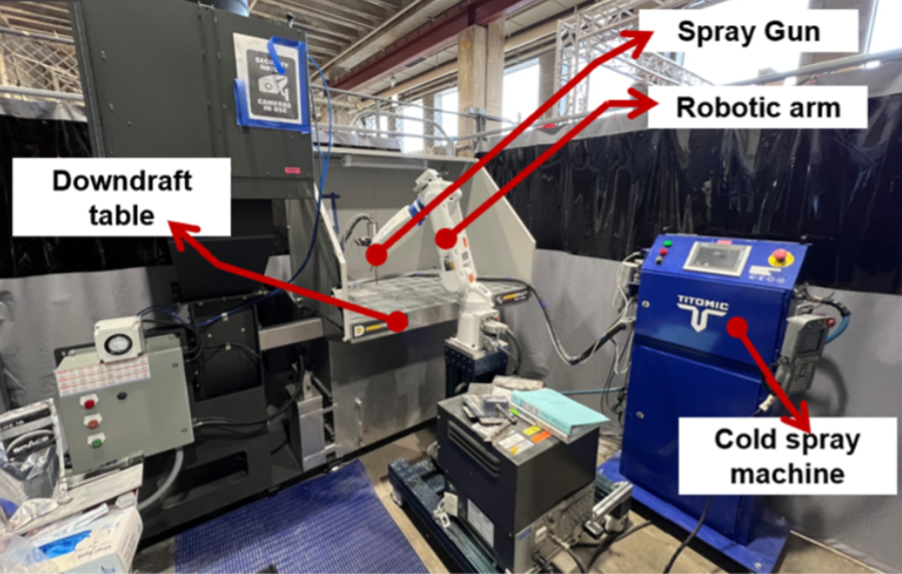
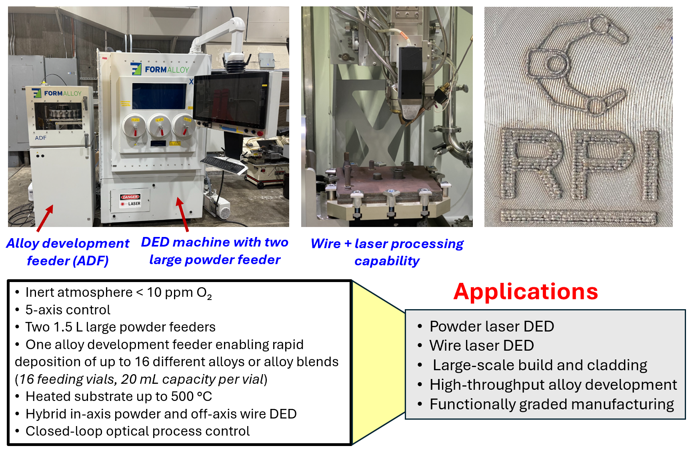

  SEMI-Lab

  

    Cold Spray Additive Manufacturing and Rapid Deposition Cell
  

  <figure style="margin: 0 0 15px 0;">
    
  </figure>

  

    The Cold Spray Additive Manufacturing and Rapid Surface Deposition Cell is equipped with a Titomic D523 cold spray system integrated with a multi-axis (6-axis) Yaskawa robotic arm, enabling precise control and programmable tool paths. The setup is complemented by a dedicated wet dust collection system to ensure safe operation. This platform accommodates a broad range of feedstock powders, including metals, ceramics, and polymers.
  

  

    5-Axis FormAlloy Laser Powder and Wire Directed Energy Deposition (DED) System
  

  <figure style="margin: 0;">
    
  </figure>

  Center for Smart Convergent Manufacturing Systems (CSCMS) 

