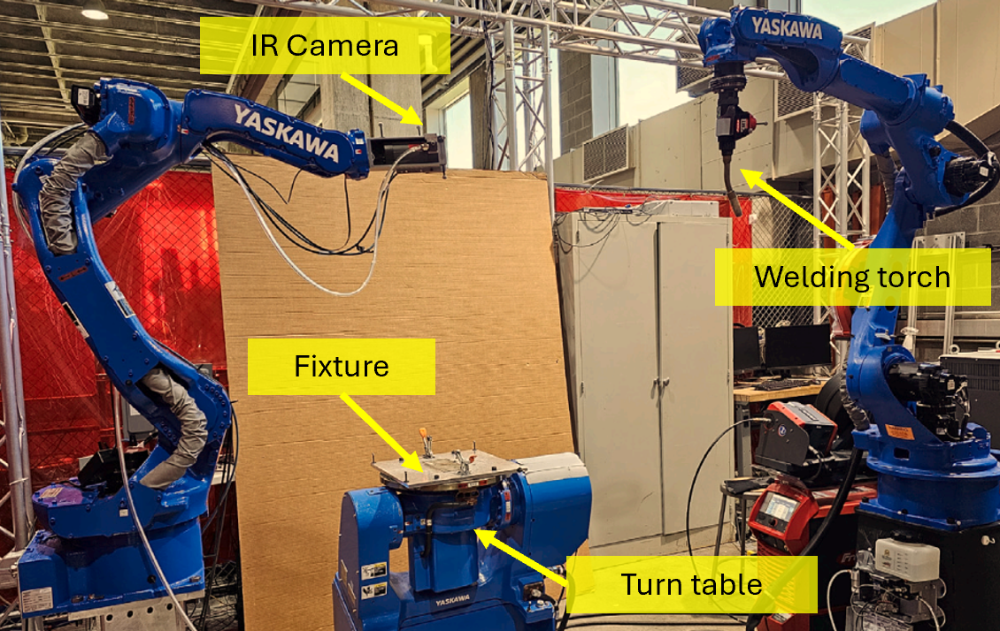
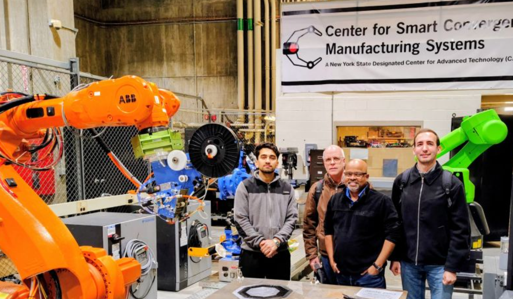

<!-- ====== SECTION HEADER ====== -->

  SEMI-Lab

<!-- ====== EQUIPMENT BLOCK 1 ====== -->

  

    Cold Spray Additive Manufacturing and Rapid Deposition Cell
  

  <figure style="margin: 0 0 20px 0;">
    
  </figure>

  

    The Cold Spray Additive Manufacturing and Rapid Surface Deposition Cell is equipped with a Titomic D523 cold spray system integrated with a multi-axis (6-axis) Yaskawa robotic arm, enabling precise control and programmable tool paths. The setup also includes a dedicated wet dust collection system to ensure safe operation and supports a broad range of feedstock powders, including metals, ceramics, and polymers.
  

<!-- ====== EQUIPMENT BLOCK 2 ====== -->

  

    FormAlloy Laser Directed Energy Deposition (L-DED) System
  

  <figure style="margin: 0 0 20px 0;">
    
  </figure>

<!-- ====== SMALL EQUIPMENT LIST 1 ====== -->

  

    Additional Lab Equipment
  

  

    • <strong>Customized Aerosol Jet Printer</strong>  
    • <strong>Customized Additive Friction Stir Deposition (AFSD) Unit</strong>  
    • <strong>FFF 3D printers (Creality K1C, Ender 3-V3)</strong>  
    • <strong>Filament extruder kit</strong>  
    • <strong>DLP Printer and washing unit (Anycubic)</strong>  
    • <strong>Optical microscope</strong>  
    • <strong>Sand blaster</strong>  
    • <strong>Grinder and polisher</strong>  
    • <strong>Pull-off adhesion tester (Elcometer 510)</strong>  
    • <strong>Powder and hazardous material storage</strong>  
    • <strong>UV-light enclosure</strong>
  

<!-- ====== CSCMS HEADER ====== -->

  Center for Smart Convergent Manufacturing Systems (CSCMS)

<!-- ====== EQUIPMENT BLOCK 3 ====== -->

  

    Wire-Arc Additive Manufacturing (WAAM) Cell
  

  <figure style="margin: 0 0 20px 0;">
    
  </figure>

  

    A sensor-rich WAAM cell is available at CMCMS at RPI, featuring multi-axis robotic control and an integrated suite of sensing modalities to support research in process monitoring, intelligent toolpath generation, defect detection, thermal characterization, and in-situ quality assurance.
  

<!-- ====== EQUIPMENT BLOCK 4 ====== -->

  

    Automatic Fiber Placement (AFP) Systems
  

  <figure style="margin: 0 0 20px 0;">
    
  </figure>

  

    The AddComposites Automatic Fiber Placement (AFP) cell enables automated composite layup with precise fiber placement, controlled deposition, and repeatable manufacturing quality.
  

<!-- ====== SMALL EQUIPMENT LIST 2 ====== -->

  

    Other Equipment at CSCMS
  

  • <strong>Customized laser powder bed fusion (LPBF) machine</strong>  
  • <strong>Universal tester (tensile, compression, flexural)</strong>  
  • <strong>High-energy planetary ball mill</strong>  
  • <strong>Haas CNC systems</strong>  
  • <strong>Water jet cutter</strong>  
  • <strong>Glovebox</strong>  
  • <strong>Markforged printers</strong>  
  • <strong>SLA printers</strong>  
  • <strong>Vertical / horizontal band saws</strong>  
  • <strong>Electronic arc welder</strong>  
  • <strong>3D scanner</strong>  
  • <strong>High-speed camera</strong>  
  • <strong>High-temperature furnace</strong>  
  • <strong>Potentiostat/Galvanostat</strong>

