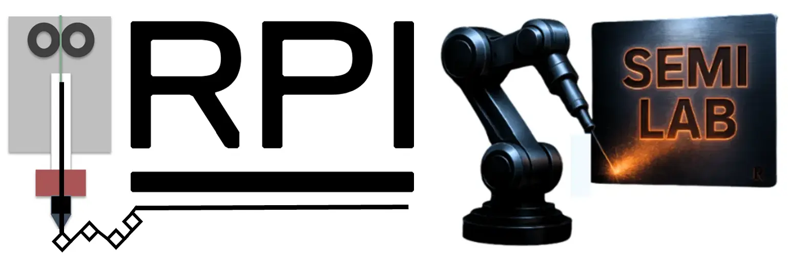

SEMI Lab is seeking for enthusiastic students at all academic levels (PhD, MS, BS) interested in surface engineering and additive manufacturing. If interested, please send your CV to Prof. Akin at <a href="mailto:akins@rpi.edu">akins@rpi.edu</a>. 

## Open Ph.D. Positions

We have several opening positions for Ph.D. students with the following research interests, and skills. Previous backgrounds can include (but not limited to) mechanical engineering, materials science, and industrial engineering. If you are interested, please contact Dr. Akin at <a href="mailto:akins@rpi.edu">akins@rpi.edu</a>.

<ul>
<li> <u> Multi-scale additive manufacturing</u>: process development, control, and optimization of AM processes (e.g., material extrusion, cold spray, aerosol jet printing, directed energy deposition.) </li>

<li> <u> 3-D printed electronics</u>: process modeling, device fabrication, mechanical design, and characterization. 
  </li>
  
<li> <u> 3-D printed energy devices and power electronics</u>: design, modeling, fabrication, and characerization of energy devices such as triboelectric nanogenerators, third generation solar cells, and batteries.
  </li>
<li> <u> Multi-material additive manufacturing</u>: multi-material printing, functionally gradient materials, cellular materials.   </li>

<li> <u> Numerical modeling of additive manufacturing processes</u>: finite element modeling and simulation tools, including but not limited to ANSYS Workbench, Abaqus, HyperMesh, and COMSOL. </li>

<li> <u> Data-driven smart manufacturing</u>: machine learning, virtual reality, process monitoring, and predictive maintenance  </li> 
 

 
 

<iframe src="https://www.google.com/maps/embed?pb=!1m18!1m12!1m3!1d2930.776523035785!2d-73.68286802402913!3d42.729620571161036!2m3!1f0!2f0!3f0!3m2!1i1024!2i768!4f13.1!3m3!1m2!1s0x89de0fa08064a661%3A0x9988e3fc27d910a9!2sDepartment%20of%20Mechanical%2C%20Aerospace%2C%20and%20Nuclear%20Engineering!5e0!3m2!1sen!2sus!4v1696722460555!5m2!1sen!2sus" width="750" height="300" style="border:0;" allowfullscreen="" loading="lazy" referrerpolicy="no-referrer-when-downgrade"></iframe> 

