<!-- Photo Collage with Arrows, Auto Transition, and Caption -->

  

    <!-- Photo 1 -->
    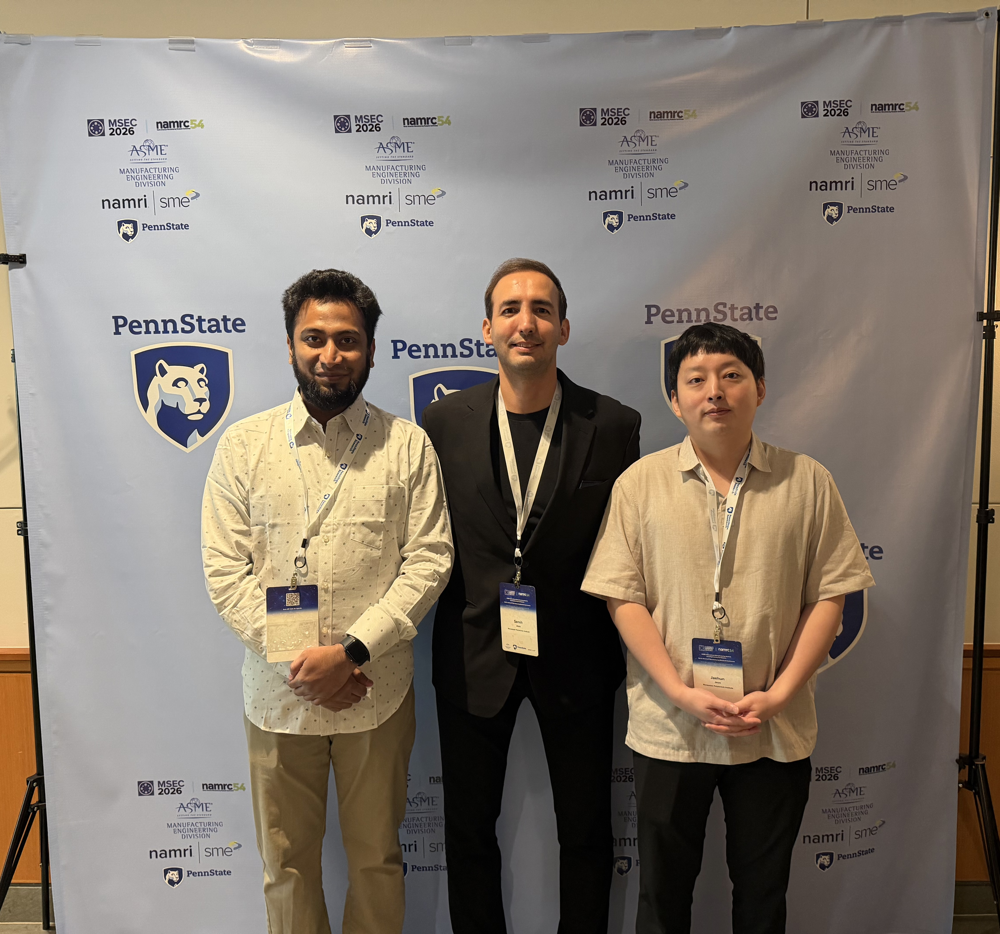
    <!-- Photo 2 -->
    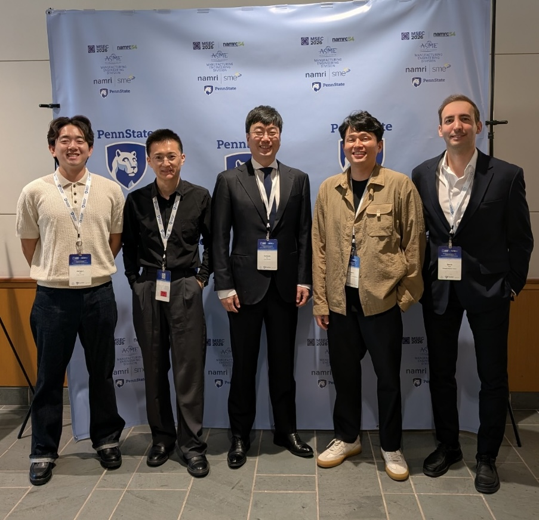
    <!-- Photo 3 -->
    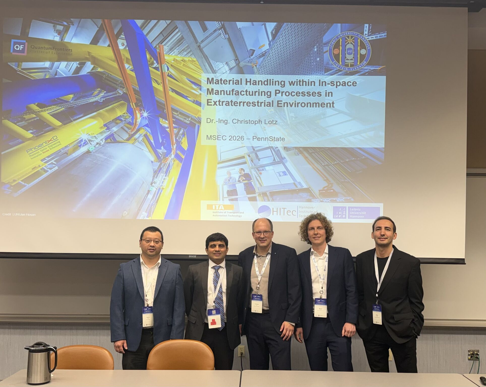
    <!-- Photo 4 -->
    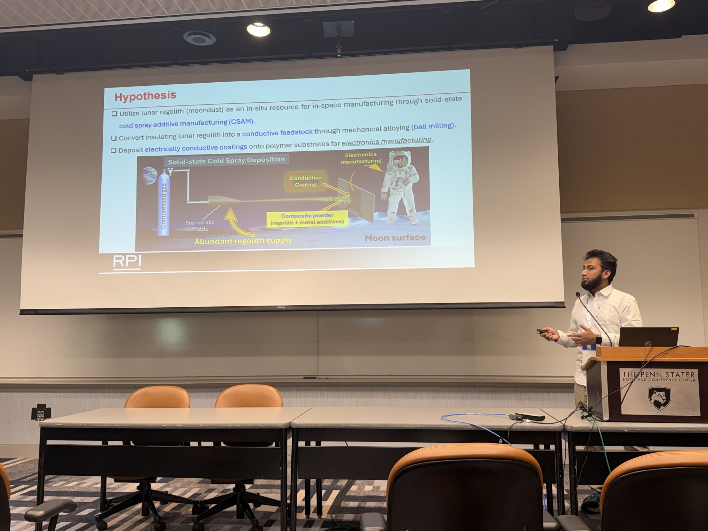
    <!-- Photo 5 -->
    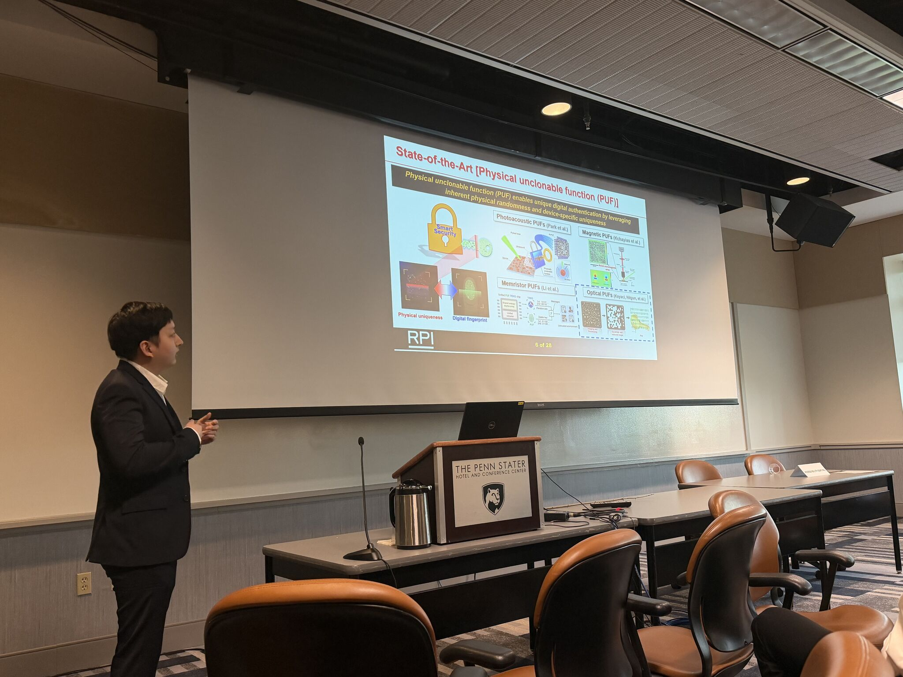
    <!-- Previous Arrow -->
    <button
      id="prev"
      type="button"
      style="
        position: absolute;
        top: 50%;
        left: 10px;
        transform: translateY(-50%);
        z-index: 10;
        background: rgba(0,0,0,0.5);
        color: white;
        border: none;
        border-radius: 50%;
        width: 40px;
        height: 40px;
        cursor: pointer;
        font-size: 22px;
      "
    >
      &#10094;
    </button>
    <!-- Next Arrow -->
    <button
      id="next"
      type="button"
      style="
        position: absolute;
        top: 50%;
        right: 10px;
        transform: translateY(-50%);
        z-index: 10;
        background: rgba(0,0,0,0.5);
        color: white;
        border: none;
        border-radius: 50%;
        width: 40px;
        height: 40px;
        cursor: pointer;
        font-size: 22px;
      "
    >
      &#10095;
    </button>

  

  
  <!-- Caption -->
  

    Our group attended the ASME MSEC/SME NAMRC-54 Conference at Penn State University (June 2026).
  

<!-- KOREAN VISITOR TO RPI -->

<!-- Photo Collage with Manual Arrows and Caption -->

  <!-- Photo Container -->
  

    <!-- Photo 1 -->
    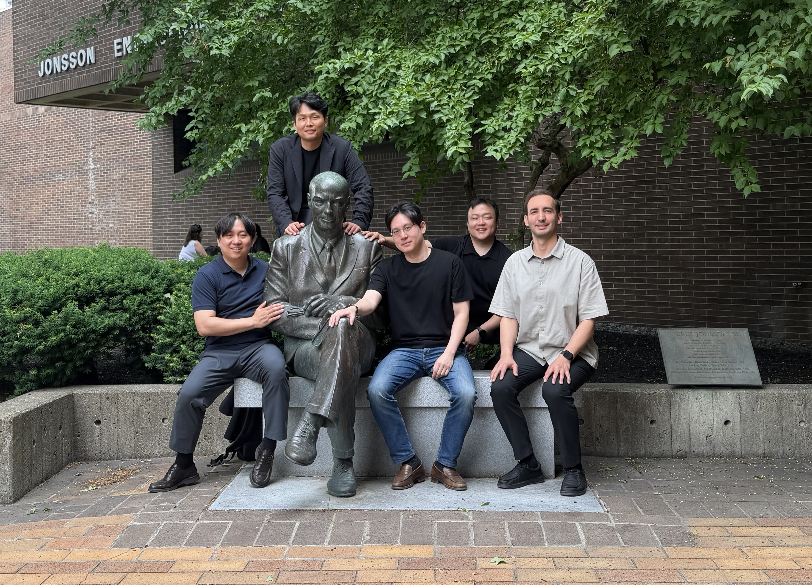
    <!-- Photo 2 -->
    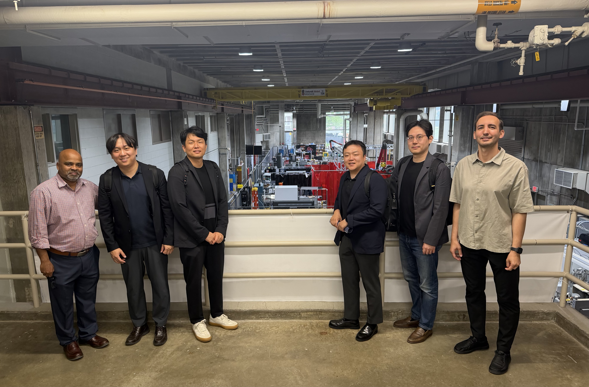
    <!-- Photo 3 -->
    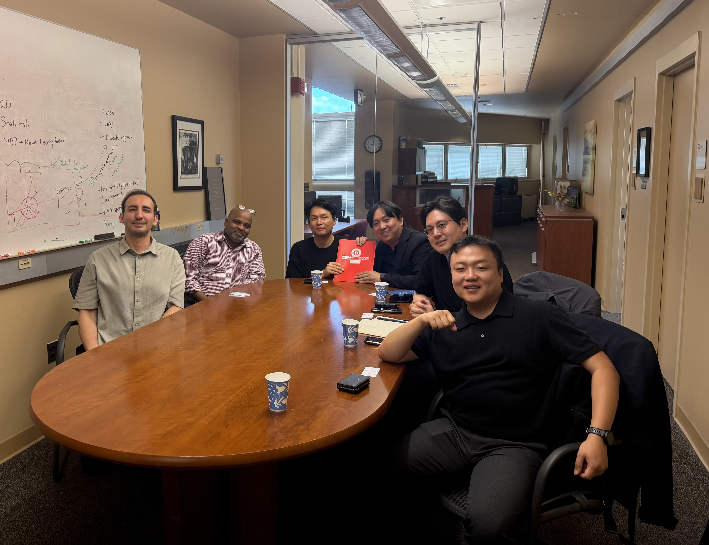
    <!-- Previous Arrow -->
    

      &#10094;
    

    <!-- Next Arrow -->
    

      &#10095;
    

  

  <!-- Caption -->
  

    SEMI-LAB hosted visitors from the Korea Institute of Industrial Technology
    (KITECH) (Dr. Jungso Nam &amp; Dr. Kyeongeun Song) and the Korea Institute
    of Machinery &amp; Materials (KIMM) (Dr. Jungsub Kim &amp; Dr. Gyuho Kim)
    (June 2026).
  

    <table class="table table-sm table-borderless">
      <tr>
        <th scope="row" style="white-space: nowrap;">Feb 16, 2026</th>
        <td> We celebrated our group’s recent publications with a lunch accompanied by Turkish tea!</td>
      </tr>
      <tr>
        <td colspan="2" style="text-align: center;">
          <figure>
                                  
          </figure>
        </td>
      </tr>
      <tr>

    <table class="table table-sm table-borderless">
      <tr>
        <th scope="row" style="white-space: nowrap;">Dec 19, 2025</th>
        <td>    Faydia has successfully completed her M.Eng. program and will be joining Sikorsky. Congrats, Faydia! </td>
      </tr>
      <tr>
        <td colspan="2" style="text-align: center;">
          <figure>
            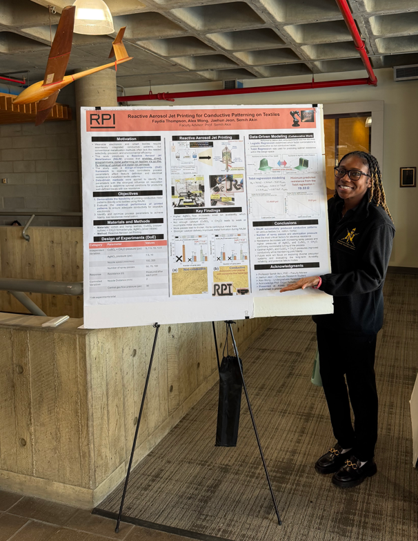                        
          </figure>
        </td>
      </tr>
      <tr>

    <table class="table table-sm table-borderless">
      <tr>
        <th scope="row" style="white-space: nowrap;">July 18, 2025</th>
        <td>    Our group participated in the NSF Engine milestone meeting as part of the RPI Team (from left to right: Prof. Akin, Prof. M. Stanley Whittingham (Nobel Laureate), Prof. Fudong Han). </td>
      </tr>
      <tr>
        <td colspan="2" style="text-align: center;">
          <figure>
            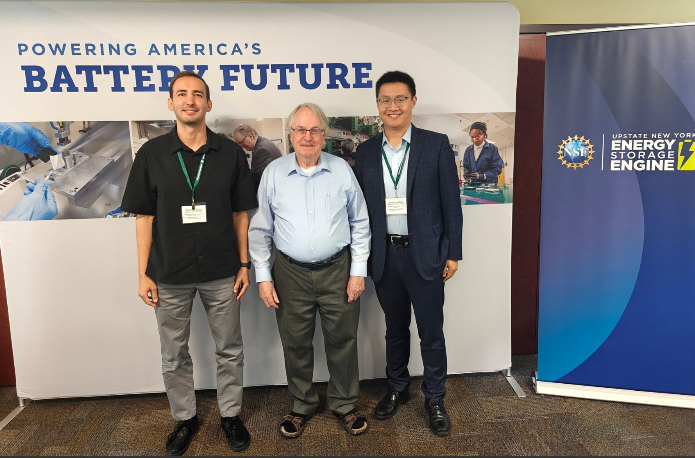                        
          </figure>
        </td>
      </tr>
      <tr>

  

    <table class="table table-sm table-borderless">
      <tr>
        <th scope="row" style="white-space: nowrap;">May 1, 2025</th>
        <td>We celebrated the end of the Spring '25 semester and bid farewell to Hongfei and Hongru Liu, who are both heading to Carnegie Mellon University.</td>
      </tr>
      <tr>
        <td colspan="2" style="text-align: center;">
          <figure>
            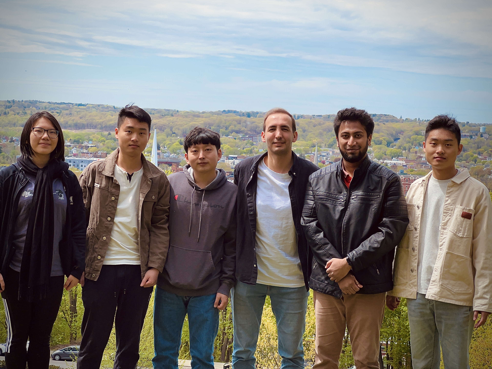                        
          </figure>
        </td>
      </tr>
      <tr>
        <th scope="row" style="white-space: nowrap;">October, 2024</th>
        <td>RPI Manufacturing Day - Blackhawk landing on campus.</td>
      </tr>
      <tr>
        <td colspan="2" style="text-align: center;">
          <figure>
                                    
          </figure>
        </td>
      </tr>
      <tr>
        <th scope="row" style="white-space: nowrap;">October, 2024</th>
        <td>We hosted Prof. Albert Shih (U-Mich) and Prof. Jianjun Shi (G-tech) at RPI.</td>
      </tr>
      <tr>
        <td colspan="2" style="text-align: center;">
          <figure>
            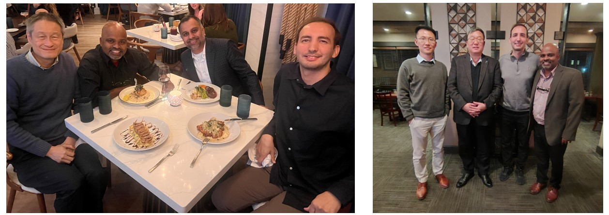                        
          </figure>
        </td>
      </tr>
      <tr>
        <th scope="row" style="white-space: nowrap;">Sep 27, 2024</th>
        <td>We hosted the DARPA SENSE program directors at RPI.</td>
      </tr>
      <tr>
        <td colspan="2" style="text-align: center;">
          <figure>
            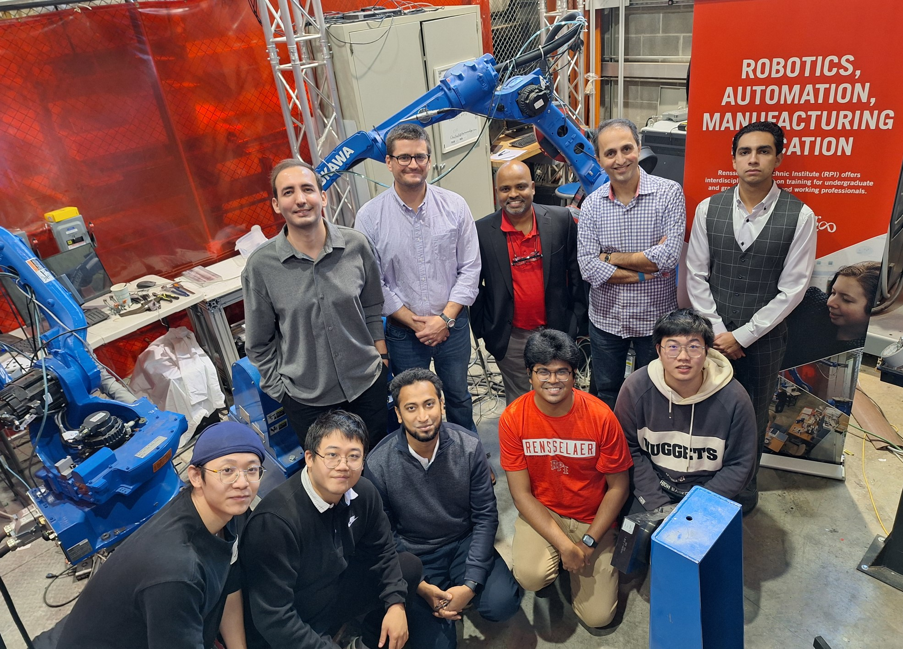                        
          </figure>
        </td>
      </tr>
      <tr>
        <th scope="row" style="white-space: nowrap;">September 24, 2024</th>
        <td>We have successfully submitted our DARPA-SENSE project deliverables. &#128077;</td>
      </tr>
      <tr>
        <td colspan="2" style="text-align: center;">
          <figure>
            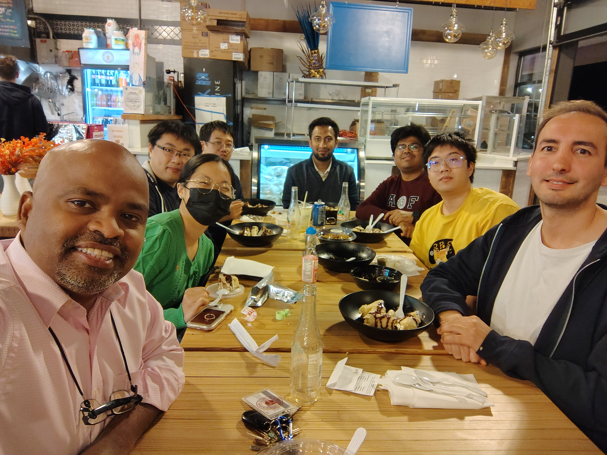
          </figure>
        </td>
      </tr>
      <tr>
        <th scope="row" style="white-space: nowrap;">June 2024</th>
        <td>Dr. Akin attended the ASME Manufacturing Science and Engineering Conference (MSEC).</td>
      </tr>
      <tr>
        <td colspan="2" style="text-align: center;">
          <figure>
            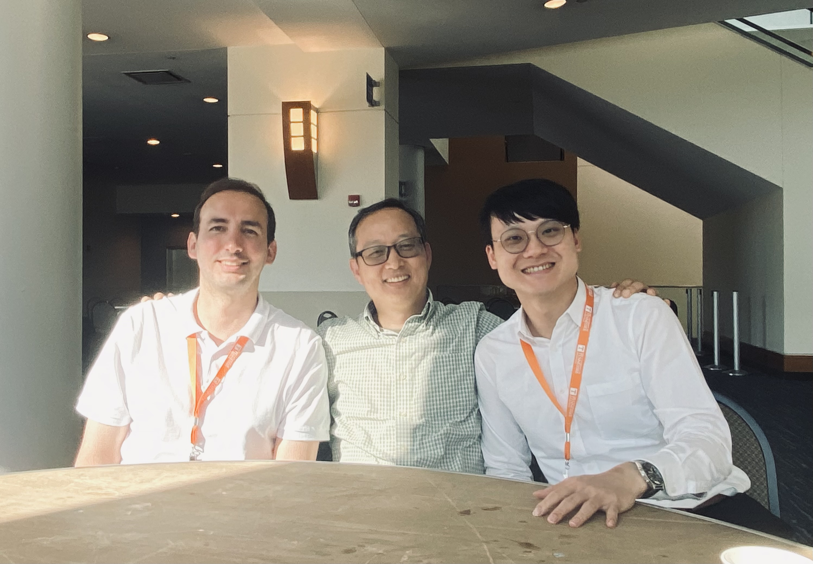
          </figure>
          <i>From left to right: Dr. Semih Akin, Dr. Martin Jun (Purdue), Dr. Jung-Ting Tsai (Taiwan-Tech).</i>
        </td>
      </tr>  
