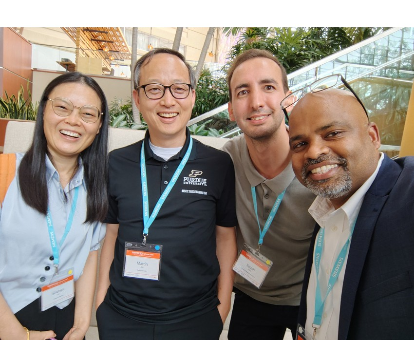
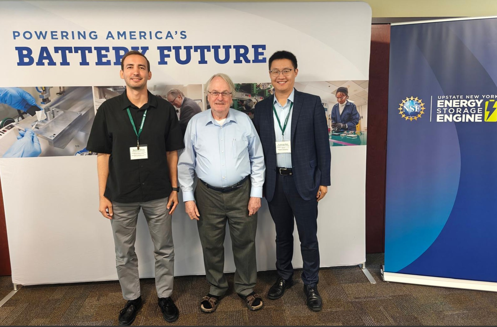

<!-- Photo Collage with Arrows, Auto Transition, and Caption -->

  

    <!-- Images -->
    
      
    
    
        
    <!-- Arrows -->
    
&#10094;

    
&#10095;

  

  <!-- Caption -->
  

    Our group attended the ASME MSEC/SME NAMRC-53 Conference in Greenville, SC (June 2025).
  

    <table class="table table-sm table-borderless">
      <tr>
        <th scope="row" style="white-space: nowrap;">Dec 19, 2025</th>
        <td>    Faydia has successfully completed her M.Eng. program and will be joining Sikorsky. Congrats, Faydia! </td>
      </tr>
      <tr>
        <td colspan="2" style="text-align: center;">
          <figure>
                                    
          </figure>
        </td>
      </tr>
      <tr>

    <table class="table table-sm table-borderless">
      <tr>
        <th scope="row" style="white-space: nowrap;">July 18, 2025</th>
        <td>    Our group participated in the NSF Engine milestone meeting as part of the RPI Team (from left to right: Prof. Akin, Prof. M. Stanley Whittingham (Nobel Laureate), Prof. Fudong Han). </td>
      </tr>
      <tr>
        <td colspan="2" style="text-align: center;">
          <figure>
                                    
          </figure>
        </td>
      </tr>
      <tr>

  

    <table class="table table-sm table-borderless">
      <tr>
        <th scope="row" style="white-space: nowrap;">May 1, 2025</th>
        <td>We celebrated the end of the Spring '25 semester and bid farewell to Hongfei and Hongru Liu, who are both heading to Carnegie Mellon University.</td>
      </tr>
      <tr>
        <td colspan="2" style="text-align: center;">
          <figure>
                                    
          </figure>
        </td>
      </tr>
      <tr>
        <th scope="row" style="white-space: nowrap;">October, 2024</th>
        <td>RPI Manufacturing Day - Blackhawk landing on campus.</td>
      </tr>
      <tr>
        <td colspan="2" style="text-align: center;">
          <figure>
                                    
          </figure>
        </td>
      </tr>
      <tr>
        <th scope="row" style="white-space: nowrap;">October, 2024</th>
        <td>We hosted Prof. Albert Shih (U-Mich) and Prof. Jianjun Shi (G-tech) at RPI.</td>
      </tr>
      <tr>
        <td colspan="2" style="text-align: center;">
          <figure>
                                    
          </figure>
        </td>
      </tr>
      <tr>
        <th scope="row" style="white-space: nowrap;">Sep 27, 2024</th>
        <td>We hosted the DARPA SENSE program directors at RPI.</td>
      </tr>
      <tr>
        <td colspan="2" style="text-align: center;">
          <figure>
                                    
          </figure>
        </td>
      </tr>
      <tr>
        <th scope="row" style="white-space: nowrap;">September 24, 2024</th>
        <td>We have successfully submitted our DARPA-SENSE project deliverables. &#128077;</td>
      </tr>
      <tr>
        <td colspan="2" style="text-align: center;">
          <figure>
            
          </figure>
        </td>
      </tr>
      <tr>
        <th scope="row" style="white-space: nowrap;">June 2024</th>
        <td>Dr. Akin attended the ASME Manufacturing Science and Engineering Conference (MSEC).</td>
      </tr>
      <tr>
        <td colspan="2" style="text-align: center;">
          <figure>
            
          </figure>
          <i>From left to right: Dr. Semih Akin, Dr. Martin Jun (Purdue), Dr. Jung-Ting Tsai (Taiwan-Tech).</i>
        </td>
      </tr>  