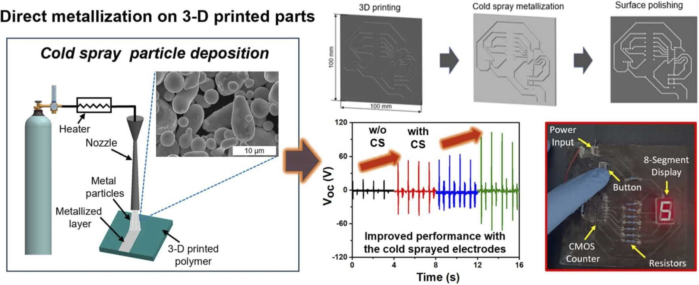
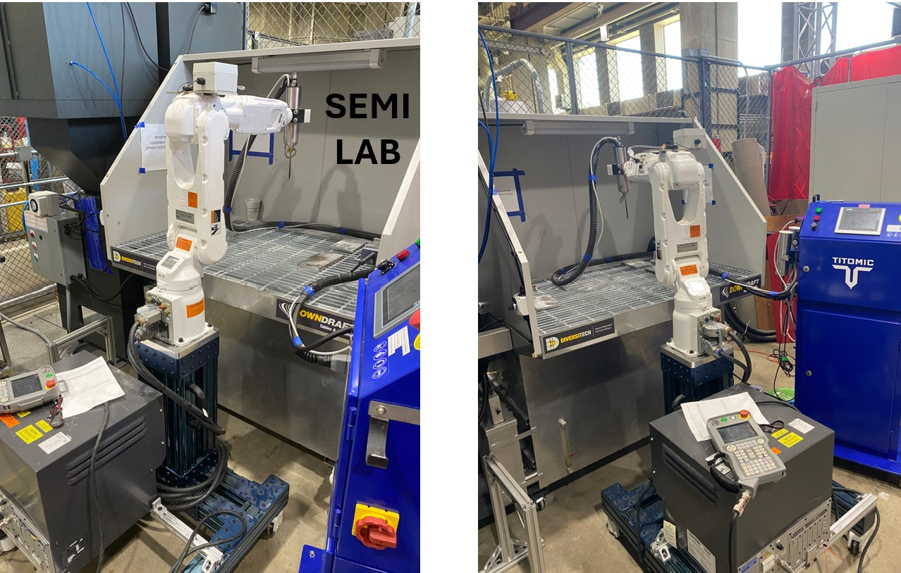
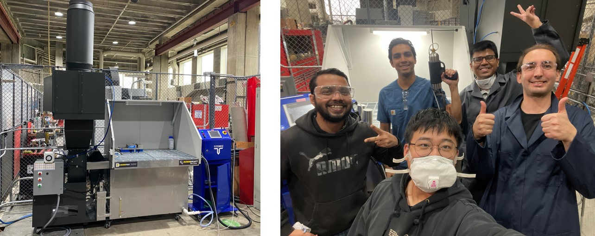

<!-- News -->

    

        <table class="table table-sm table-borderless">
            <tr>
                <th scope="row" style="white-space: nowrap;">December, 2024</th>
                <td>
                    Our group has been awarded a grant from the 
                    NSF Engines R&D Awards - New York Energy Storage Engine Projects. 
                    This funding will support the development of an innovative 
                    "<i>Dry coating method for lithium-ion battery anodes</i>". 
                    &#9733;
                </td>
            </tr>
        </table>
    

 
          

    

        <table class="table table-sm table-borderless">
            <tr>
                <th scope="row" style="white-space: nowrap;">November, 2024</th>
                <td>
                  Our work has received the Best Paper Award  at the ASME's International Mechanical Engineering Congress & Exposition (IMECE-2024). &#9733;
                </td>
            </tr>
            <tr>
                <td colspan="2" style="text-align: center;">
                    <figure>
                                                
                    </figure>
                </td>
            </tr>
            <tr>     
      

    

        <table class="table table-sm table-borderless">
            <tr>
                <th scope="row" style="white-space: nowrap;">August, 2024</th>
                <td>
                    Our collaborative work has been published in the esteemed journal of <i>Nano Energy</i> <a href="https://doi.org/10.1016/j.nanoen.2024.110082">[Link]</a>. &#128077; 
                </td>
            </tr>
            <tr>
                <td colspan="2" style="text-align: center;">
                    <figure>
                                               
                    </figure>
                </td>
            </tr>
            <tr>

    

        <table class="table table-sm table-borderless">
            <tr>
                <th scope="row" style="white-space: nowrap;">June, 2024</th>
                <td>
                    Multi-axis robotic cold spraying capability has been deployed at SEMI Lab. &#9733;
                </td>
            </tr>
            <tr>
                <td colspan="2" style="text-align: center;">
                    <figure>
                                               
                    </figure>
                </td>
            </tr>
            <tr>

    

        <table class="table table-sm table-borderless">
            <tr>
                <th scope="row" style="white-space: nowrap;">April, 2024</th>
                <td>
                    We have successfully established a "Cold Spray Additive Manufacturing Cell" at RPI &#9733;
                </td>
            </tr>
            <tr>
                <td colspan="2" style="text-align: center;">
                    <figure>
                                                
                    </figure>
                </td>
            </tr>
            <tr>
                <th scope="row" style="white-space: nowrap;">Feb, 2024</th>
                <td>
                    Our lab has become a part of DARPA-SENSE project to develop "smart metallic structures". &#9733;
                </td>
            </tr>
                        <tr>
                <th scope="row" style="white-space: nowrap;">Jan 1, 2024</th>
                <td>
                    Dr. Akin has joined <a href="https://www.rpi.edu/">Rensselaer Polytechnic Institute</a> as an Assistant Professor of Mechanical Engineering. &#9733;
                </td>
            </tr>
            <tr>
                <th scope="row" style="white-space: nowrap;">Oct 26, 2023</th>
                <td>
                    Dr. Akin gave a seminar at the University of Illinois Chicago (UIC) on <i>"Spray-based Additive Manufacturing of Functional Smart Surfaces".</i>
                </td>
            </tr>
            <tr>
                <th scope="row" style="white-space: nowrap;">May 20, 2023</th>
                <td>
                    Dr. Akin received the Early Career Travel Award by the NSF to attend <a href="https://msec-namrc2023.rutgers.edu/">NAMRC/MSEC 2023</a>.
                </td>
            </tr>
            <tr>
                <th scope="row" style="white-space: nowrap;">May 20, 2023</th>
                <td>
                    Dr. Akin was selected as one of the winners of the International Research Awards on Computer Aided Design in Mechanical Engineering.
                </td>
            </tr>
            <tr>
                <th scope="row" style="white-space: nowrap;">March 21, 2023</th>
                <td>
                    Dr. Akin received the <a href="https://engineering.purdue.edu/Engr/People/Awards/Graduate/ptRecipientListing?group_id=237384&show_sub_groups=1">Outstanding Graduate Student Research Award</a> by the CoE at Purdue University.&#x1F44D;
                </td>
            </tr>
            <tr>
                <th scope="row" style="white-space: nowrap;">Dec 23, 2022</th>
                <td>
                    Dr. Akin was selected as one of the winners of the <a href="https://machinesitalia.org/italian-technology-awards">Italian Packaging Technology Awards</a>.
                </td>
            </tr>
        </table>
    

