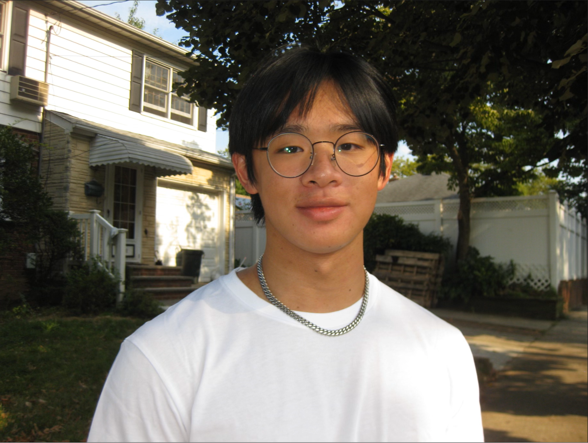
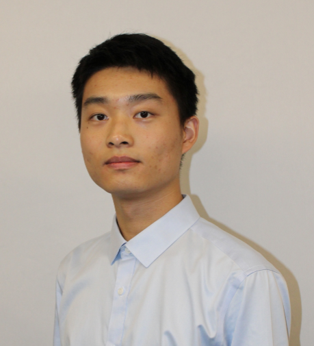
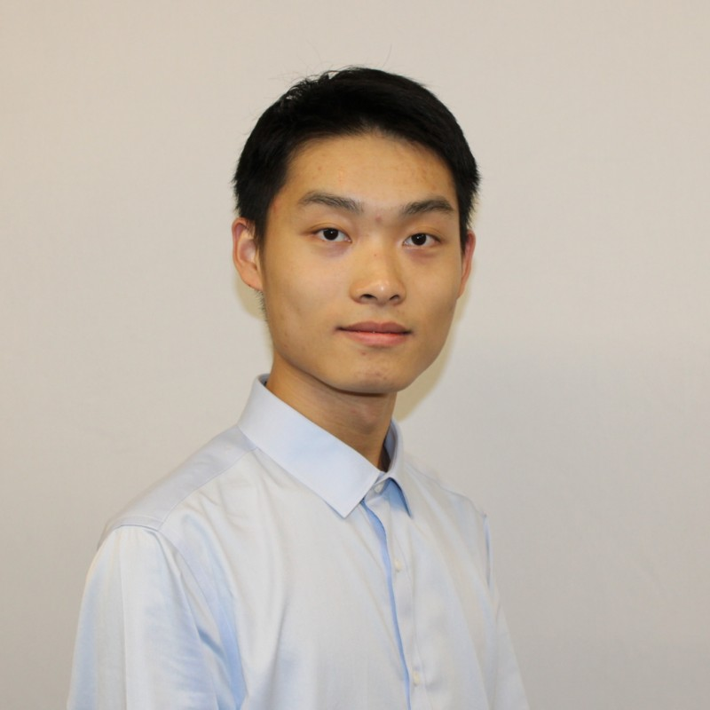

## Faculty

    
    

        <b>Semih Akin</b>, Ph.D. <a href="https://semi-lab.github.io/assets\pdf\Semih_Akin_CV.pdf">[CV]</a>
         
        Assistant Professor
         
        Department of Mechanical, Aerospace, and Nuclear Engineering (MANE)
         
        Rensselaer Polytechnic Institute (RPI)
         
        Erik Jonsson Engineering Center, Troy, NY 12180
             
        &#128231;<a href="mailto:akins@rpi.edu" style="margin-right: 10px;"> akins@rpi.edu</a>
            
    

 
 Dr. Semih Akin is a tenure-track Assistant Professor of Mechanical Engineering at [Rensselaer Polytechnic Institute (RPI)](https://www.rpi.edu/). He earned his Ph.D. in Mechanical Engineering from [Purdue University](https://www.purdue.edu/) in 2022, where he also worked as a Postdoctoral Fellow before joining RPI. He is the recipient of Purdue's College of Engineering `Outstanding Graduate Student Research Award` and `Lambert Teaching Fellowship` in recognition of his contributions to both research and teaching. Dr. Akin's cross-disciplinary research focuses on surface engineering and advanced multi-scale manufacturing, with applications in 3D-printed electronics, smart films, electronic textiles, and energy devices.  
 

## Ph.D. Students

    
    

        <b>Sazedur Rahman</b>
         
        PhD Student 
         
        <i> Department of Mechanical, Aerospace, and Nuclear Engineering (MANE) </i>
         
        Research Interests: Additive Manufacturing, Smart structures
         
        &#128231;<a href="mailto:rahmas5@rpi.edu" style="margin-right: 10px;"> rahmas5@rpi.edu</a>
            
    

 

## MS Students
 

## Undergraduate Students

<!-- Profile Card for Zhi Cheng Guan -->
<!--

    
    

        <b>Zhi Cheng Guan</b> 
        BS Student 
        <i>Department of Mechanical, Aerospace, and Nuclear Engineering (MANE)</i> 
        Research Interests: Additive manufacturing, aerosol printing 
        &#128231;<a href="mailto:guanz2@rpi.edu" style="margin-right: 10px;">guanz2@rpi.edu</a>
         
    

  -->

    
    

        <b>Alex Wong
</b> 
        BS Student 
        <i>Department of Mechanical, Aerospace, and Nuclear Engineering (MANE)</i> 
        Research Interests: Additive manufacturing, Aerosol jet printing 
        &#128231;<a href="mailto:wonga9@rpi.edu" style="margin-right: 10px;">wonga9@rpi.edu</a>
      <!--   -->
    

 

    
    

        <b>Travis Johnson
</b> 
        BS Student 
        <i>Department of Mechanical, Aerospace, and Nuclear Engineering (MANE)</i> 
        Research Interests: Smarts sensors, Aerosol jet printing 
        &#128231;<a href="mailto:johnst10@rpi.edu" style="margin-right: 10px;">johnst10@rpi.edu</a>  
                       
    

 

    
    

        <b>Hongfei Liu
</b> 
        BS Student 
        <i>Department of Mechanical, Aerospace, and Nuclear Engineering (MANE)</i> 
        Research Interests: Aerosol jet printing 
        &#128231;<a href="mailto:liuh23@rpi.edu" style="margin-right: 10px;">liuh23@rpi.edu</a>         
    

 

    
    

        <b>Hongru Liu
</b> 
        BS Student 
        <i>Department of Mechanical, Aerospace, and Nuclear Engineering (MANE)</i> 
        Research Interests: Aerosol jet printing 
        &#128231;<a href="mailto:liuh24@rpi.edu" style="margin-right: 10px;">liuh24@rpi.edu</a>         
    

 

<!-- 

    
    

        <b>Brandon Villanueva
</b> 
        BS Student 
        <i>Department of Mechanical, Aerospace, and Nuclear Engineering (MANE)</i> 
        Research Interests: Hybrid manufacturing 
        &#128231;<a href="mailto:villab@rpi.edu" style="margin-right: 10px;">villab@rpi.edu</a>
         
    

  -->

## Past Members
<body>  
    <li>Sazidur Shahriar Rahman, <i>Ph.D. Student</i> (Spring-Summer 2024)</li> 
    <li>Brandon Villanueva, <i>Undergraduate Research Student</i> (Spring-Summer 2024)</li>  
        <li>Zhi Cheng Guan, <i>Undergraduate Research Student</i> (Spring 2024)</li>        
    </body>

